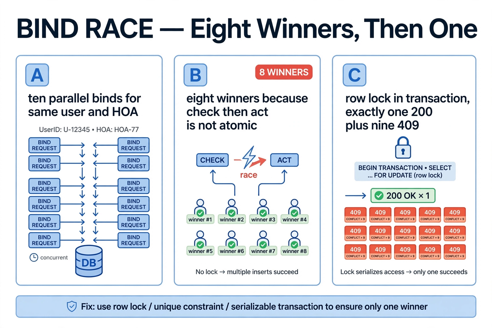
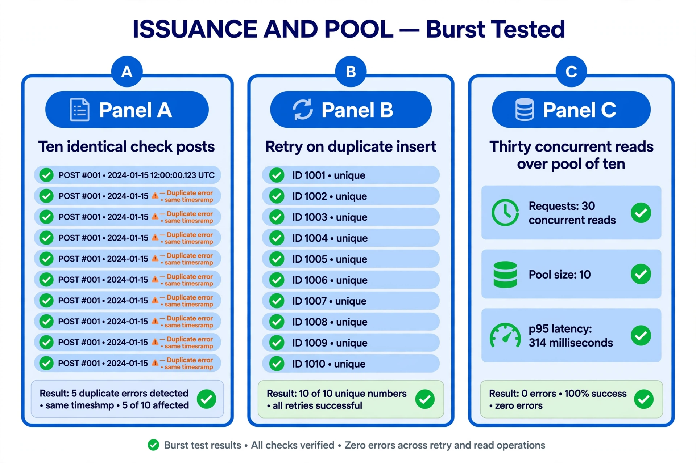
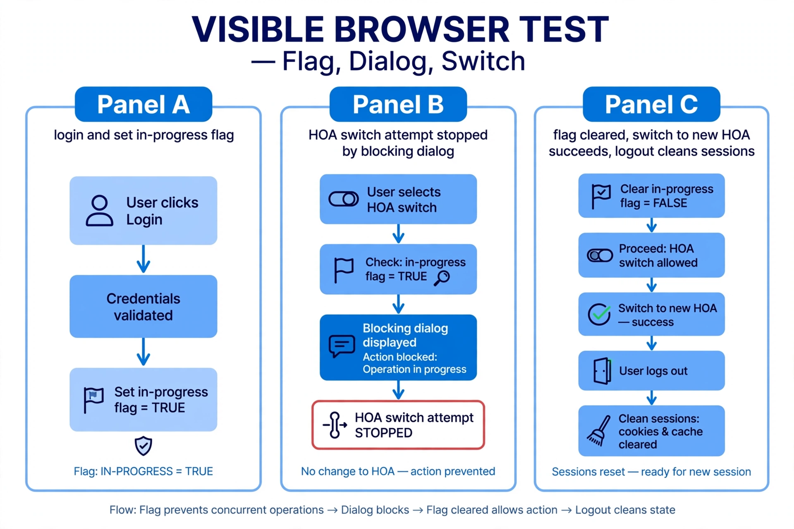
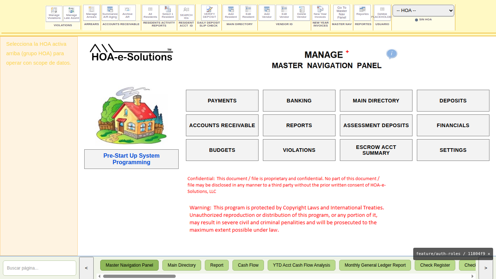
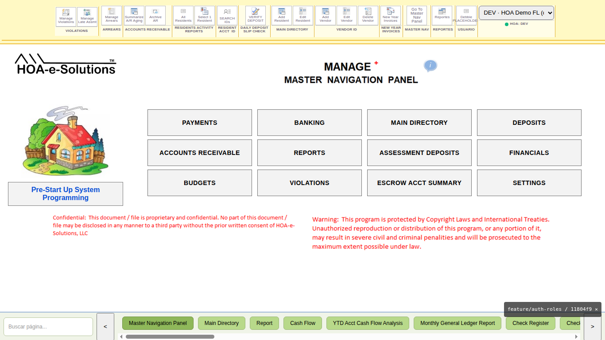

# W M+ Auth — Test Report (Phases 1–5 + Blocking Pilot)

**Branch:** `feature/auth-roles` · **Target:** dev backend 3013 + `hoamanager26_dev`/`hoam26_auth`
**Production untouched** (8888/9997/9998/9999 never exercised). All test data cleaned afterwards.
Scripts: `backend/scripts/stress-auth.js`, `stress-t1.js`, `stress-t2.js` (committed, repeatable).

## Correctness battery: 5/5

| # | Case | Result |
|---|---|---|
| 1 | Login storm 15× | 15/15 distinct sessions |
| 2 | 10 parallel binds, same (User, HOA) | **1×200 + 9×409** (after fix; first run: 8×200 — see bug below) |
| 3 | Cross-HOA reads (own/foreign mix) | own 200, foreign 403, zero 500 |
| 4 | Mutation with stale HOA context | 403, zero writes verified in DB |
| 5 | Cleanup | 0 active sessions, 0 STRESS residues |

**Bug found by test 2:** `bindActiveHoa` check-then-act was non-atomic — 8 parallel binds all won.
Fix: transaction + `SELECT … FOR UPDATE` on the user row (serializes binds per user).
Re-run: exactly one winner. No schema change (history preserved, per Rick).

## Issuance burst (T1): 10/10

10 identical `POST check-register` in one burst: first run 5×201 + 5×500 `Duplicate entry`
(same timestamp tick; the generator's existence check cannot see uncommitted rivals).
Fix: rollback + retry on `ER_DUP_ENTRY` (max 5) → **10/10 201, 10 unique numbers**.
15 STRESS rows deleted afterwards, 0 leftovers.

## Pool exhaustion (T2): p95 314 ms, 0 errors

30 heavy concurrent reads over a pool of 10: **30×200** — min 173 ms, p50 270 ms,
p95 314 ms, max 318 ms. The queue drains cleanly.

## Blocking pilot E2E (visible browser, display :1001, Debbie @5175)

Automated headed-Chromium run: login → set `check-printing` flag → HOA switch attempt →
dialog *"No se puede cambiar de HOA ahora. | Operación en curso: check-printing. |
Complétala o cancélala antes de cambiar."* → switch aborted (stored HOA unchanged) →
flag cleared → switch to HOA 7 OK → logout. Session table left clean.

Note: native `alert()` is OS chrome and cannot appear in page screenshots; the dialog
text above is verbatim from the run. Manual capture via NoMachine recommended for pixels.

## Residue statement

`CheckRegister` STRESS rows: 0 · `hoa.notes` STRESS: 0 · `LIC-HOA2` forged rows: 0 ·
test sessions active: 0 · `TXN-DEV-*` fixtures: intact.
