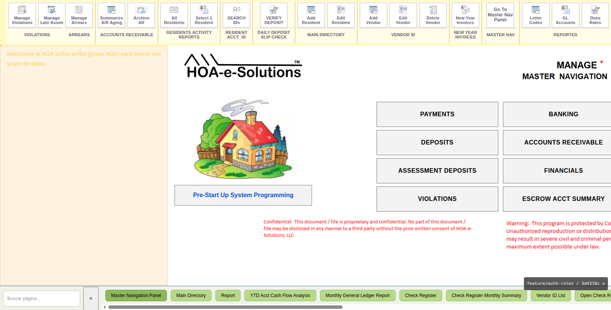
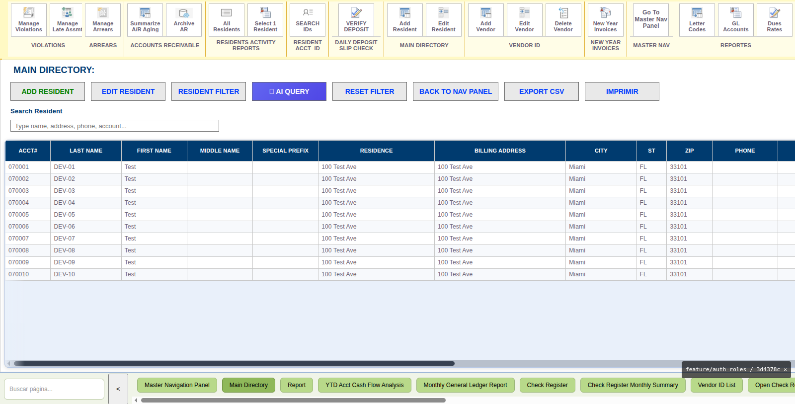
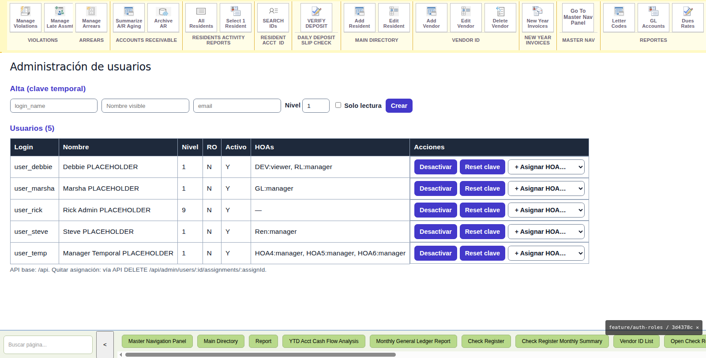
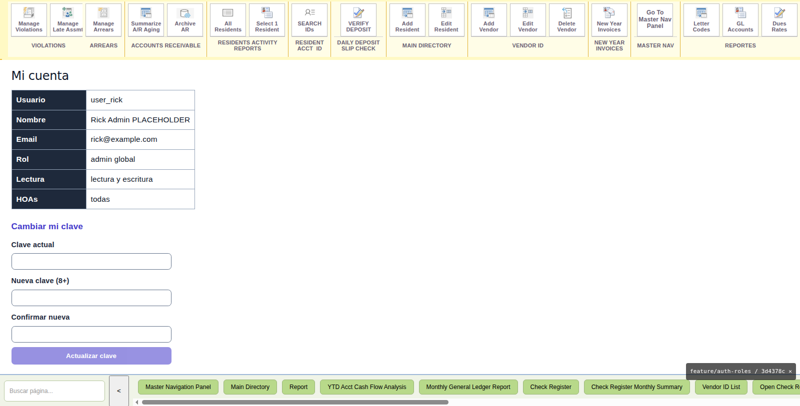

# HOA-based access control for the W M+ web app

**To:** Rick — **From:** Jose — **Date:** 2026-09-14 — **Branch:** `feature/auth-roles`

## 1. The problem you described

- One Excel file per HOA; nothing shared, nothing auditable.
- Ambiguous initials: "GL" means Governors Landing, not General Ledger.
- Who manages what lives in your head: Debbie → RL (Remington Landing),
  Marsha → GL (Governors Landing), Steve → Renaissance.
- Three more HOAs coming in Colorado, soon with Zego and websites.

## 2. What we built (demo database `hoam26_auth`, from scratch)

A central **directory**: management company → HOAs (each with an explicit
short code `RL`/`GL`/`Ren`, legal name and license number) → users →
**assignments** (user × HOA × role). No more initials guessing, no more
brain-RAM: the directory is data now.

Roles: **admin** (everything, that's you), **manager** (their HOAs),
**viewer** (read-only per HOA). Web sessions expire after 30 minutes idle
(replaces the old password form + 10-minute timer of the Excel).

Every HOA carries its **own** settings, dues rates, fine/letter codes and
GL accounts (copied from a template per HOA), its Zego/website onboarding
flags, and payment rules — including the no-service-fee rule for Colorado.
Writes are sealed to the active HOA: a manager can never touch another
HOA's rows, even by manipulating requests.

## 3. How it looks (demo screenshots)

### Login — role-based access

### Main Directory scoped to one HOA (DEV selected, 10 residents)

### User administration (admin only)

### My account — session, role and HOAs

## 4. What we need from you

1. **The directory Excel**: HOA code, legal name, license number, city/state
   for RL, GL, Ren and the 3 new Colorado HOAs; manager per HOA
   (Debbie/Marsha/Steve or someone new).
2. Confirm Colorado HOAs must not charge service fees to residents
   (that's the current default).
3. Demo access (users + passwords) goes separately — ask Jose.

## 5. What's next

Real seed from your Excel, then business data phases (vendors/checks,
payments/APR, year-end close), and merge of this branch after your push
to `BravoFrontend`.
