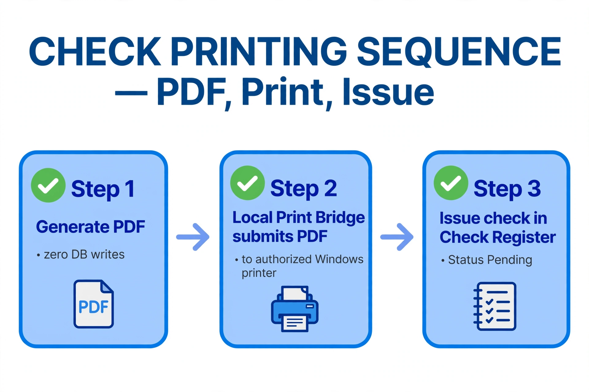
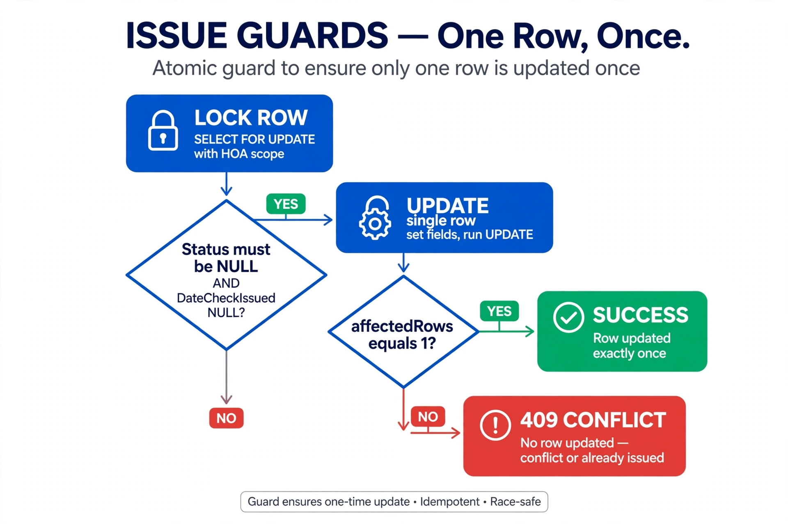
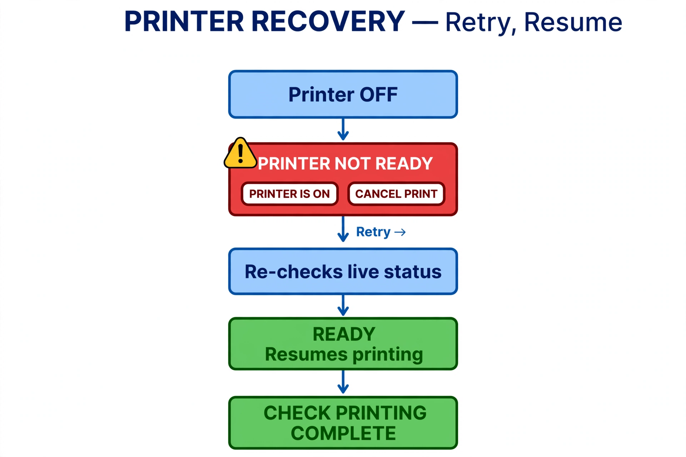
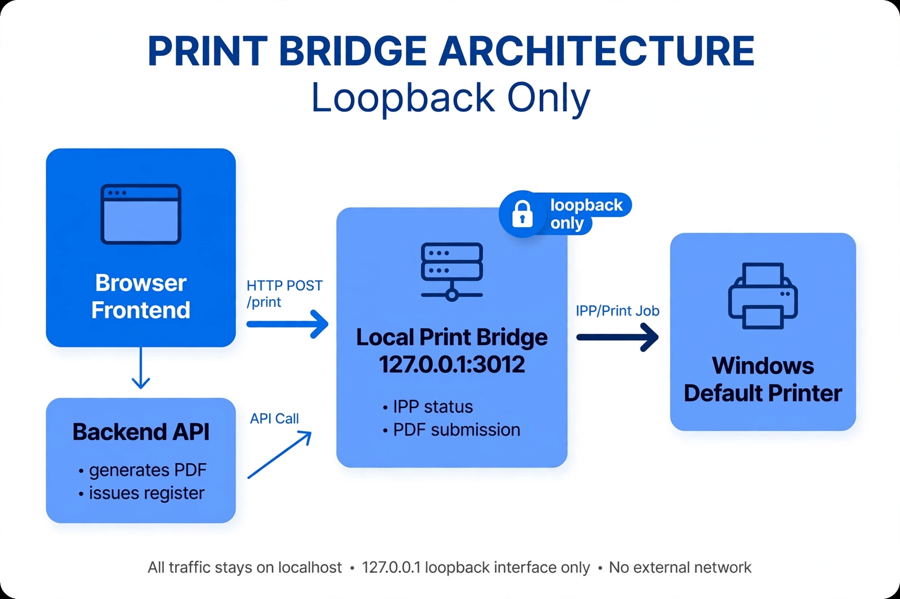

# W M+ Check Creator — End-to-End Physical Printing — Review Report

**Branch:** `feature/windows-print-status-checkpoint` · **Tip:** `783775c` (2026-09-22, Rick)
**Reviewer:** Jose (code-only review, no live test — physical printing runs on Windows)
**Date:** 2026-09-23

Rick's test statement: fresh IPP readiness check → PDF with zero DB writes → physical
submission through the Local Print Bridge → issuance only after successful submission →
printer OFF blocks issuance → PRINTER NOT READY popup with retry/cancel → OFF→ON recovery
→ single + three-check sequential printing → checks 1026, 1027, 1028 verified Pending.

## Commits under review

| Commit | Title | Scope |
|---|---|---|
| `ec2591b` | WIP: Check Creator, PDFKit, MICR, and Check Register work | +2498/−44 — PDF engine, Check Creator UI, test-hack removal, Banking modes |
| `f2be392` | Windows IPP printer-status milestone | +350 — print bridge, printer discovery, PrintEngine |
| `783775c` | Complete end-to-end Check Creator physical printing | +511/−107 — pdf/issue split, `/print-pdf`, popups |

## Verification (code review vs. claimed behavior)

| # | Claimed behavior | Code evidence | Result |
|---|---|---|---|
| 1 | PDF generation performs zero DB writes | New `POST /api/print-checks/pdf` uses pool `db` directly, no `getConnection`/`beginTransaction`; `loadCheckPrintData` = SELECT + joins; `getHoaTimeZone` = SELECT SystemSettings + in-memory tz | ✅ Confirmed structurally |
| 2 | Issuance only after successful bridge submission | Frontend loop per check: pdf → `submitPdfForPrint` → `POST /api/print-checks/issue`; any throw skips `issue` | ✅ Confirmed |
| 3 | Printer OFF prevents issuance | `confirmPrinterReadyForPrint` gate before loop; non-READY opens popup instead of throwing | ✅ Confirmed |
| 4 | PRINTER NOT READY popup with retry/cancel | `showPrinterUnavailable` overlay: PRINTER IS ON re-checks + resumes, CANCEL PRINT closes | ✅ Confirmed |
| 5 | Each printed check independently Pending | `issue` is per-transaction (`FOR UPDATE` + single-row UPDATE + commit per check) | ✅ Confirmed |
| 6 | Completion confirmation + return to register | `CHECK PRINTING COMPLETE` popup with per-count message; OK calls `onClose` | ✅ Confirmed |
| 7 | Race-safe issuance | `SELECT … FOR UPDATE` with MgtCo+HOA scope; UPDATE requires `DateCheckIssued IS NULL AND Status IS NULL`; `affectedRows===1` else 409; button disabled via `isCreatingChecks` | ✅ Confirmed |
| 8 | Test scaffolding removed | `ec2591b` deletes the TEMPORARY ALEX TESTING hack — new checks enter NULL/NULL (precondition for the guards) | ✅ Confirmed |
| 9 | Bridge loopback-only | `print-service.js` listens on `127.0.0.1:3012` (before and after); `PRINT_BRIDGE_URL` is loopback; CORS `*` contained to the machine | ✅ Confirmed |

## Observations (non-blocking)

**O1 — Partial-batch resume reprints.** If `issue` fails on check 2 of 3, retry calls
`createSelectedChecks()` from check 1: the pdf endpoint has no Status guard, the bridge
reprints physically, and only `issue` returns 409. Suggest a resume index (continue from
the failed check) or a Status pre-check before bridge submission.

**O2 — No reprint path after a paper jam.** Any existing `Status` now returns 409 and the
UPDATE requires NULL/NULL (previously `Pending` could re-issue). Correct as "issue once",
but post-issue jam recovery has no defined operator procedure.

**O3 — Bridge has no own package.json.** `require('pdf-to-printer')` resolves via
`backend/node_modules` (works only if backend deps are installed). Suggest an explicit
`backend/print-service/package.json` or a startup check.

**O4 — Dead weight.** Three empty placeholder components
(`PrintChecksActions/Details/Lists.jsx`, 0 bytes) and binary blobs with no source in repo
(`IppStatusHelper.exe`, 3 MICR `.ttf`, 3 `.dotx` templates) — accepted as-is, noted for
provenance (native helper source requested).

**O5 — Pre-existing.** Frontend `localhost:3011` URLs now in two endpoints; `pdf-preview`
route untouched while the UI no longer opens PDFs (physical-only by design).

## Auth integration

`POST /api/print-checks/issue` carries hardcoded scope with `TODO(scope-merge)` markers
(`HOA-FL-2024-001` / `MGTCO-001` / `SYSTEM`) — consistent with keeping `feature/auth-roles`
separate until the integration design (security levels, active-HOA switching, session
rules, frontend/cache clearing) is jointly agreed. The future merge will conflict exactly
on these hunks; that is the right time to wire `req.hoa`.

## Verdict

**Approve with minor observations.** Architecture is sound, race guards are correct, and
the test-hack removal restores the production invariant the issuance flow depends on.

## Open questions for Rick

1. Operator procedure for O1 (printed-but-not-issued) and O2 (post-issue jam)?
2. Confirm checks 1026–1028 started from NULL/NULL state?
3. `IppStatusHelper.exe` source or acceptance of the blob?
4. Do you want this branch merged to BravoFrontend, and with what strategy for the two
   local-only docs commits (`e0f7b3e`, `3ab74bf`)?
