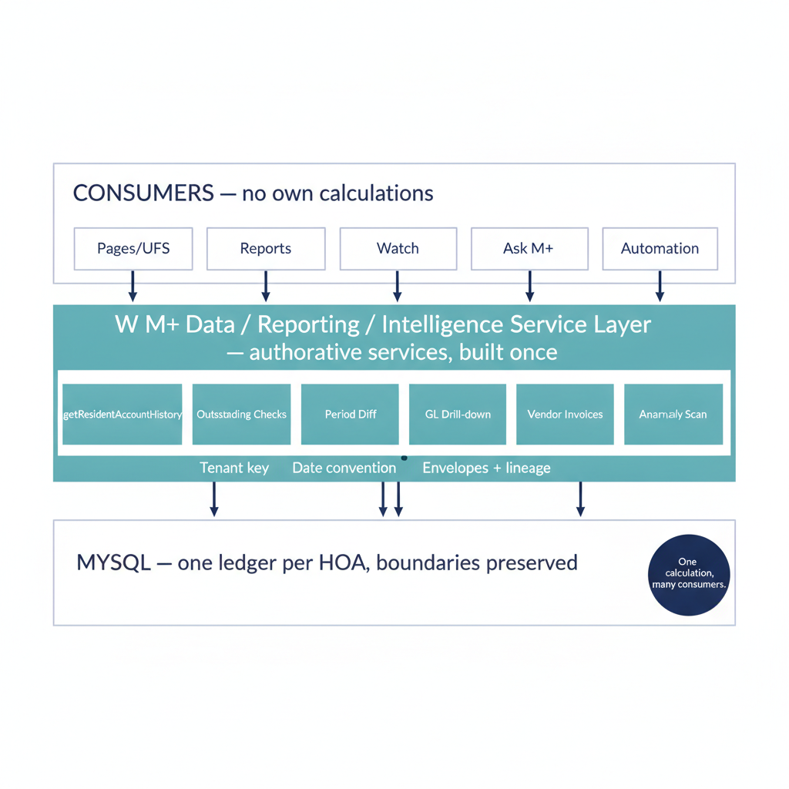
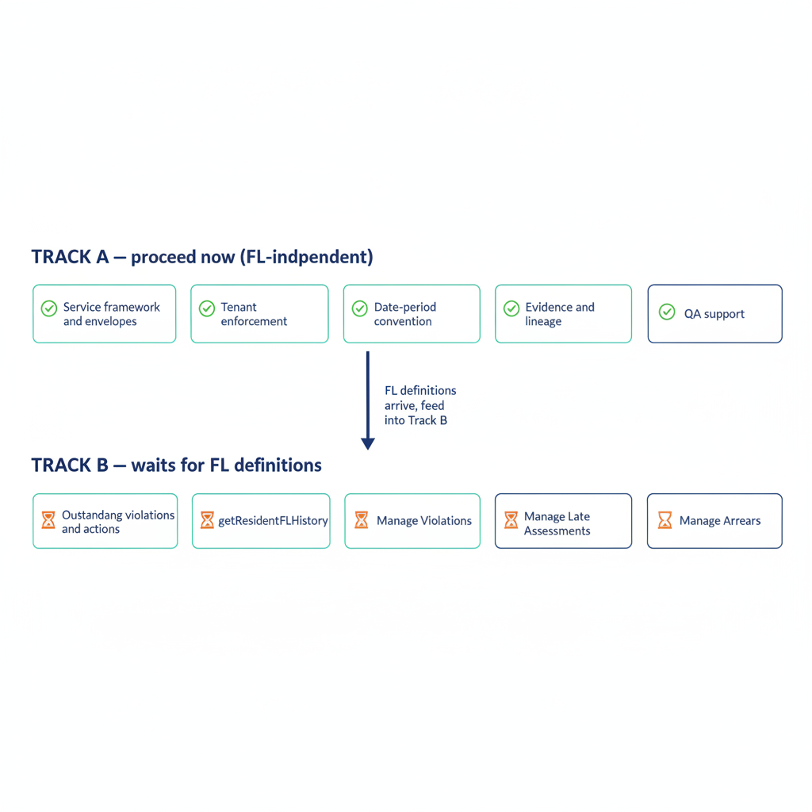
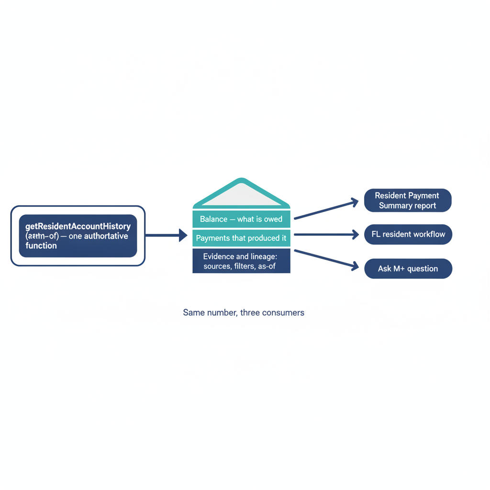
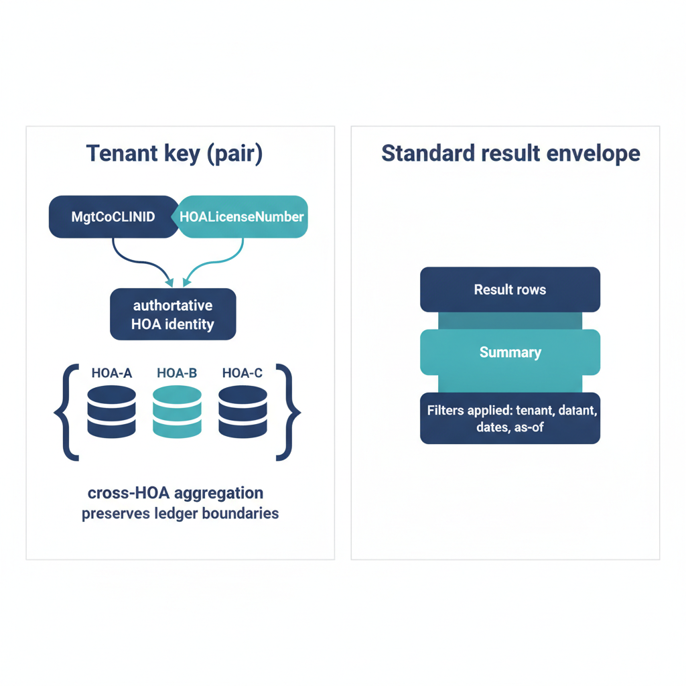
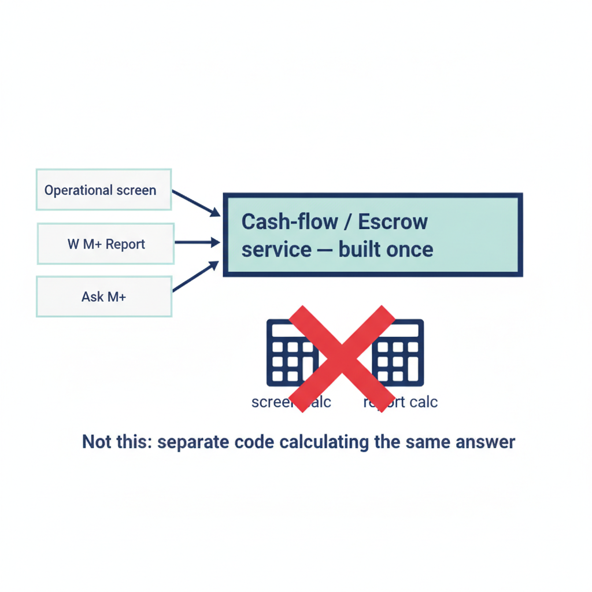

# W M+ Data / Reporting / Intelligence Service Layer — v1 Scope (FL-independent portion)

Status: **DRAFT for approval** — no service code until Rick & Hal approve this scope.
Date: 2026-09-28. Companion PDF: `SERVICE-LAYER-SCOPE-V1.pdf` (illustrated).

## 1. Standing design policy (adopted)

- Authoritative server services are built **once**. Pages, UFs, reports, Watch, Ask M+,
  voice and automation **consume the same calculations**.
- No separate pieces of code independently calculating the same accounting answer.
- Ask M+ is **one consumer** of the layer, not the layer itself.
- Reports follow the same policy: a report consumes the same authoritative service
  calculation an operational screen or Ask M+ would consume. The existing
  Escrow/cash-flow reuse is the model, not the exception.

## 2. Two tracks

| Track | Content | Status |
|---|---|---|
| **A — generic / service-layer** | Common query/service pattern, tenant enforcement, standard date/range filters, evidence/lineage support, event/status access, standard result/summary envelopes, QA support, underlying framework for future consumers | **Proceed now** |
| **B — FL-specific** | Outstanding-violations/actions function, `getResidentFLHistory()` and similar, anything under Manage Violations / Manage Late Assessments / Manage Arrears | **Wait for Rick/Hal FL definitions** |

## 3. v1 function list (the eight questions — locked)

| # | Question | Track | Proposed authoritative function |
|---|---|---|---|
| 1 | What does this resident owe? | A | `getResidentAccountHistory(...)` (balance section) |
| 2 | What payments produced this balance? | A | `getResidentAccountHistory(...)` (provenance/evidence sections — same call as Q1) |
| 3 | Which checks remain outstanding? | A | `getOutstandingChecks(...)` over Check Register (`Issued → Pending → cleared`) |
| 4 | What changed between two periods? | A | `getPeriodDiff(...)` — requires the common date/period convention (§5) first |
| 5 | Which transactions belong to this GL#? | A | `getGLTransactions(...)` — GL drill-down over existing ledgers |
| 6 | What violations/actions are outstanding? | **B** | Blocked on Manage Violations + Rick/Hal definitions |
| 7 | What invoices belong to this vendor? | A | `getVendorInvoices(...)` over existing AP/vendor data; future intake enriches, does not block |
| 8 | What is unusual or overdue? | A, bounded | Generic anomaly framework proceeds; assessment-overdue thresholds follow FL (Late Assessments/Arrears) when defined |

Q1+Q2 are **one function, not two**: balance + the payments that produced it + evidence
references, so the report, the FL workflow and Ask M+ cite the same number.

## 4. Tenant key (corrected, adopted)

- Authoritative tenant/HOA key: **`(MgtCoClientID, HOALicenseNumber)`** — not the `ClientID` shorthand.
- Every Track A function enforces this pair; cross-HOA aggregation, when authorized,
  preserves individual HOA/ledger boundaries.

## 5. Common conventions (proposed — need sign-off before building on them)

1. **Date/period filtering**: one convention for as-of dates, ranges and fiscal periods,
   shared by all seven Track A functions.
2. **Standard envelopes**: every answer returns `{ result rows, summary, lineage/evidence
   refs, filters applied (tenant, dates, as-of) }` plus error conventions and
   pagination/limits.
3. **Evidence/lineage**: each answer carries its sources (tables/rows, filters, as-of
   point) so reports, screens and Ask M+ cite the same basis.

## 6. "Add while building" (adopted — not retrofitted)

As the applicable FL/server pieces are built, incorporate: append-only FL event history,
sent-letter history, status-transition history, origin/reference information, and
vendor-change history (keeps invoice intake possible later; **no intake implementation now**).

## 7. Reports reuse

New W M+ Reports consume the §3 functions; they never reimplement the calculation.

## 8. Track A work plan (proposed order)

1. Service framework: envelopes, error conventions, pagination/limits.
2. Tenant enforcement on `(MgtCoClientID, HOALicenseNumber)` + cross-HOA boundary rule.
3. Date/period convention proposal → Rick/Hal sign-off.
4. Evidence/lineage fields in every envelope.
5. Event/status **read** access pattern over existing data (new FL event tables arrive
   with the FL pieces per §6).
6. Seven Track A functions, `getResidentAccountHistory(...)` first as the reference.
7. QA support: fixtures + per-function verification in the QA environment.

## 9. Explicitly out of scope

- FL-dependent function(s) and FL rule implementations.
- The 12-level authorization catalog/mapping (awaiting spec, incl. 8 read-only levels).
- Invoice intake implementation.

## 10. Inputs needed from Rick & Hal

1. ~~Exact text of the eight v1 questions~~ — **received 2026-09-28, locked in §3.**
2. Approval of this scope + the §5 conventions.
3. Later: authorization catalog, then FL definitions per workflow as they finalize.
