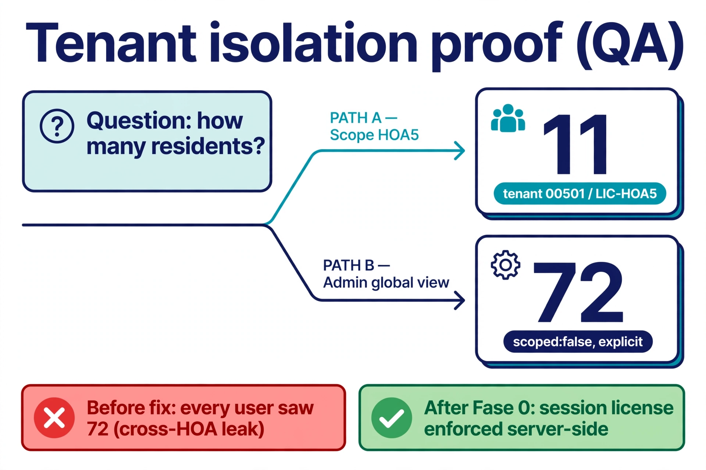
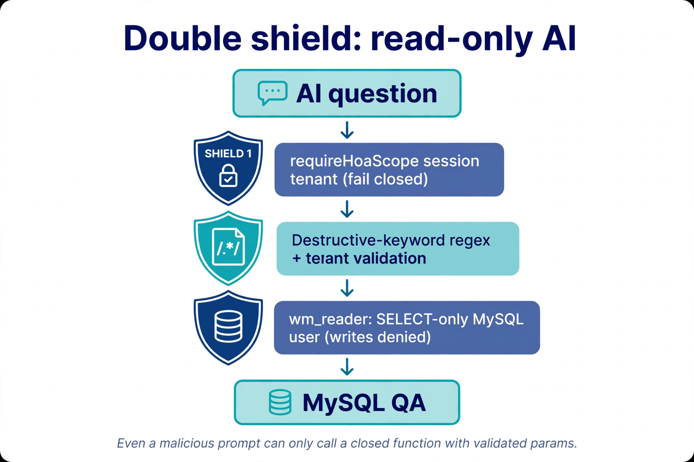
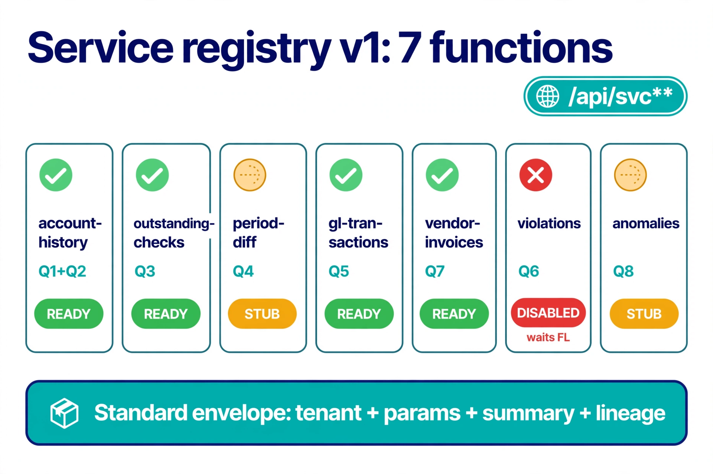
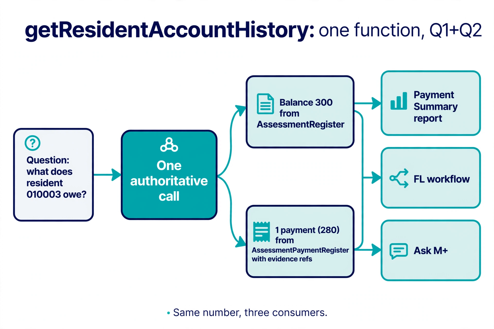
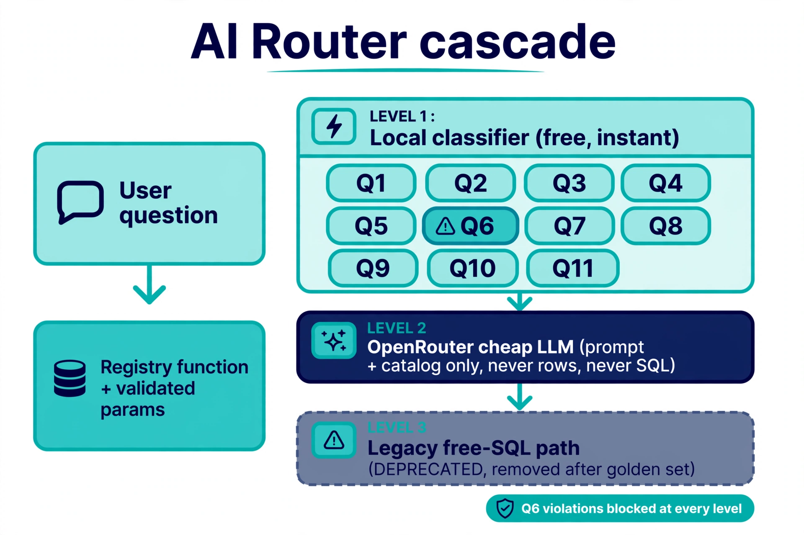

# Track A — progress report (2026-09-28, branch `feature/service-layer`)

Locked inputs from Rick & Hal: canonical tenant `(ClientID, HOALicenseNumber)`,
date/period rules 1-6 + both fixes, QA simulation authorized, Track A proceeds
independent of FL. This report shows what was built and verified in QA.

## 1. Integration first

Merged Rick's `e7ef7cf` (CR reconciliation + Outstanding) + `de769cc`
(APR clear/batch/void) before any Track A code. Q3 builds on his Outstanding
structures. Conflict resolution: kept `zip-to-tz` (Rick) + `authMid` (ours);
kept HOA-scoped writes + DUP retry; discarded Alex's temporary PRINT-CHECKS
hack; APR list combines tenant filter with `Status IN (POSTED,VOID)`.

## 2. Fase 0 — AI safety (tenant leak closed)

`POST /api/ai-filter` had no HOA scope: any user saw all HOAs (72 residents
instead of 11). Now: `requireHoaScope`, server-side `HOALicenseNumber`
filter (parameterized), fail-closed answer validation, standard
`tenant/scoped` envelope, prompt+license logging. Admin `X-HOA-ID: all`
keeps an explicit global view.

Double shield: session tenant + destructive-keyword regex + `wm_reader`
(SELECT-only MySQL user, writes denied at the privilege level).

## 3. Simulated tenant in QA (prod untouched)

`hoa.client_id` populated (RL/GL/Ren = `00125`, singles, DEV separate).
Finding: `UNIQUE(client_id)` contradicted the approved model (one ClientID
to many HOAs) — replaced by a plain index **in QA only**; prod keeps UNIQUE
until Rick authorizes the change at real backfill. Settings Client ID# now
shows the canonical value, both identity fields read-only.

## 4. Date standard implemented (rules 1-6)

`resolveFiscalWindow()`: explicit range > `FiscalYearSetup` (per HOA) >
`hoa.fiscal_year_start` > calendar (flagged). Plus `containing(date)` mode
for clear/pay flows. Per-ZIP timezone cache (was global). Migrated 9 spots
(ledger, cash-flow page, check/deposit clear, 3x APR, escrow, YTD,
monthly-GL). QA FY2026 = calendar, so windows are identical — verified with
real data (escrow GL 41700 = known fixture).

## 5. Registry v1 — 7 functions behind `/api/svc/*`

| Function | Q | Status | QA proof |
|---|---|---|---|
| getResidentAccountHistory | Q1+Q2 | ready | balance 300 + 1 payment (010003) |
| getOutstandingChecks | Q3 | ready | 2 checks, 312.50 |
| getPeriodDiff | Q4 | stub | honest, resolves both windows |
| getGLTransactions | Q5 | ready | 4 txns, net 12500 (fixture) |
| getVendorInvoices | Q7 | ready | correct shape |
| getOutstandingViolations | Q6 | disabled | 403, waits for FL |
| getAnomalies | Q8 | stub | honest, overdue follows FL |

All reads via `readOnlyPool`; concrete HOA required (no cross-HOA until
express rule); envelope carries tenant + resolved params + lineage.

## 6. AI router — providers

- Level 1 local classifier (11 intents, free, instant).
- Level 2 OpenRouter cheap LLM (~$0.001/translation, prompt+catalog only,
  never rows, never SQL; Q6 banned even for the LLM). Driver by env.
- Level 3 legacy free-SQL path, DEPRECATED, removed after golden set.
- Golden set: `golden-set.md` (8 questions with expected routes/values).

## 7. Commits (feature/service-layer)

`5bca2f1` merge Rick, `13078cb` AI fix, `3a2e332` auth UI,
`13f8f29` Fase 0, `c0b97ed` tenant, `d654eec` dates,
`0a8a2b0` registry, `8875409` router.

## Open items (need Rick/Hal or Alvaro)

- Real ClientID→HOA Excel (pre-prod backfill) + drop UNIQUE(client_id) in prod.
- Authorization catalog (12 levels) — still pending from Rick/Hal.
- FL definitions → Q6 + overdue rules + FL histories.
- Ask M+ skeleton consumes the registry (next build).
