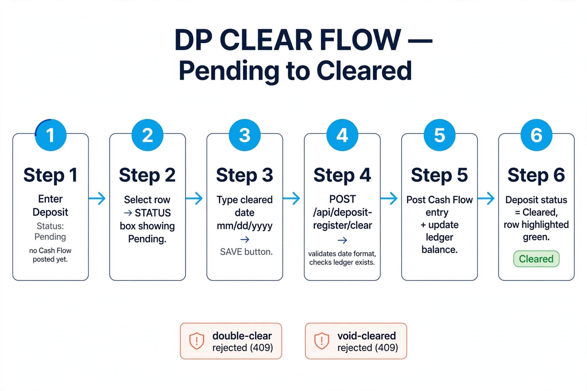
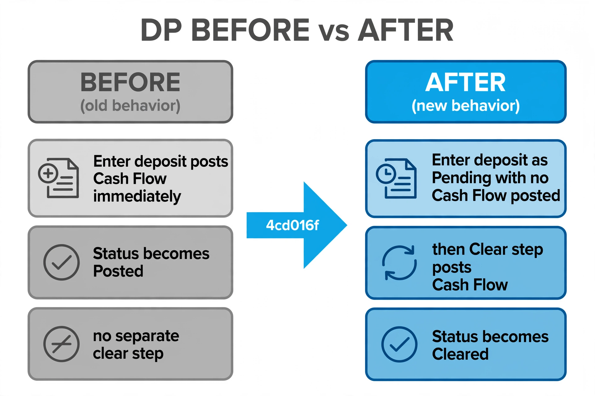
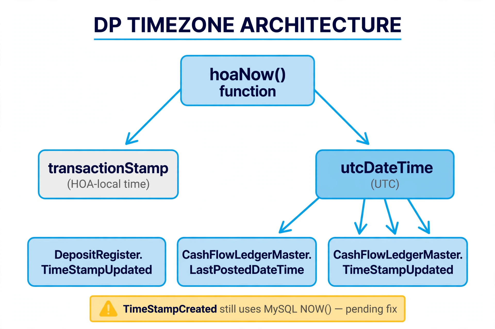
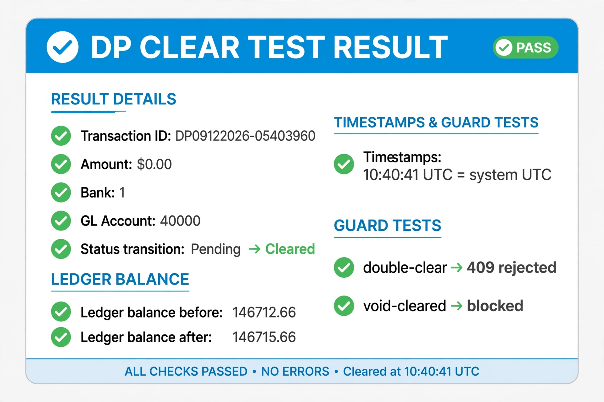

# DP Bank Reconciliation Clearing — Report for `4cd016f`

> Commit: `4cd016f — Complete DP bank reconciliation clearing` (Rick, 2026-09-11)
> Branch: `BravoFrontend` · Reviewer: Jose · Date: 2026-09-12
> Images: `meta/muse-image` via OpenRouter (~$0.04 total)

## 1. What changed

`POST /api/deposit-register` now enters deposits as **`Pending`** (no Cash Flow).
A new `POST /api/deposit-register/clear` (STATUS/SAVE workflow) validates the
cleared date, posts Cash Flow and updates the ledger, then marks the deposit
**`Cleared`**. The DP void path was simplified to Pending-only (a `Cleared`
deposit can no longer be voided).

## 2. UTC preservation (verified in diff + live)

The new clear routine uses `(await hoaNow(connection)).utcDateTime` for both
`CashFlowLedgerMaster` (`LastPostedDateTime`, `TimeStampUpdated`) and
`DepositRegister` (`TimeStampUpdated`). CR/APR writers untouched.

## 3. Live DP clear test (`hoamanager26_dev`, backend 3011)

| Item | Value |
|---|---|
| Txn | `DP09122026-05403960` |
| Amount / bank / GL | $3.00 · bank 1 · GL 40000 |
| Flow | `Pending → Cleared` (`2026-09-12`, month 9) |
| Ledger | `146712.66 → 146715.66` |
| Stamps | `10:40:41` = system UTC (`date -u` 10:41 / Chicago 05:41) ✅ |
| Guards | double-clear → `already been cleared` · void-cleared → `cannot be voided` ✅ |

Learning notes: bank `101` → `409 ledger not established` (ledger uses
`BankAccountID 1`); GL `4000` → outside Cash Flow ranges (used `40000`).
Both trial deposits were voided. `TimeStampCreated` is still MySQL-time —
awaiting Rick's fix #2.

## 4. Test artifacts (dev only)

2 voided Pending deposits (no Cash Flow) + 1 cleared $3 deposit with Cash Flow.
No action taken to reverse the cleared $3 — confirm if a reversal is wanted.

## 5. Next steps

1. Rick: (1) DP txn number → `hoaNow.transactionStamp`, (2) DP
   `TimeStampCreated` → UTC. No overlap — DP section is his.
2. After his two pushes: swap `zipcode-detail-lookup` (83 MB) → `zip-to-tz`
   (34 KB).
