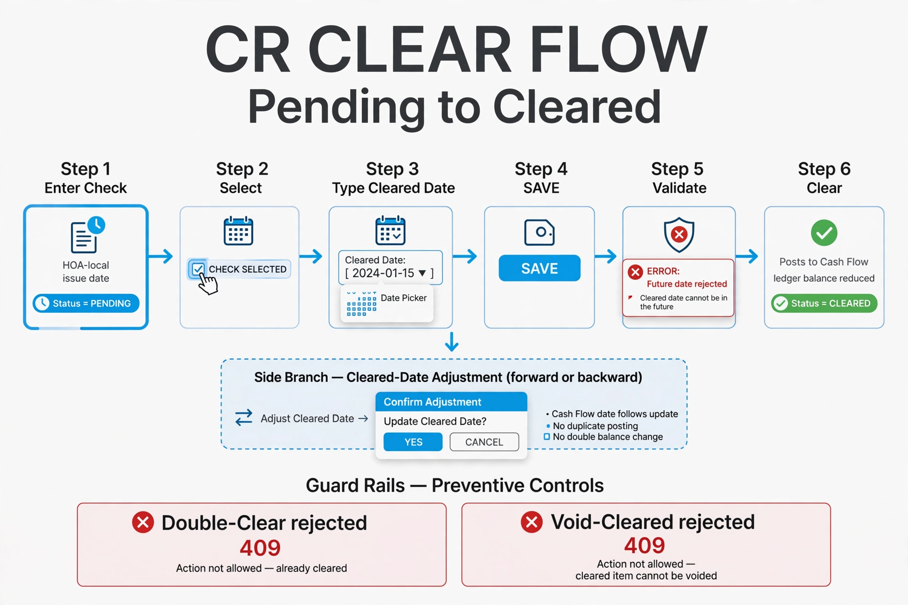
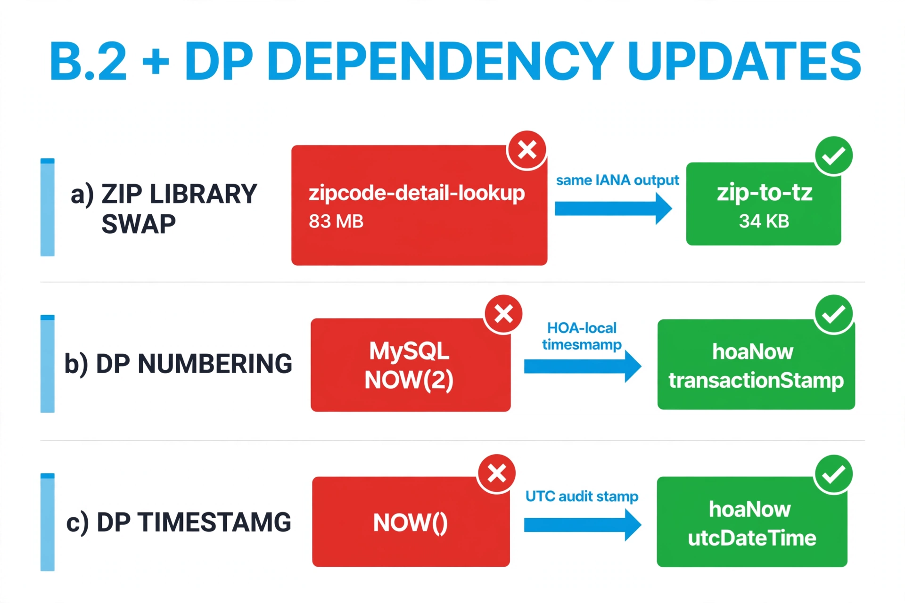
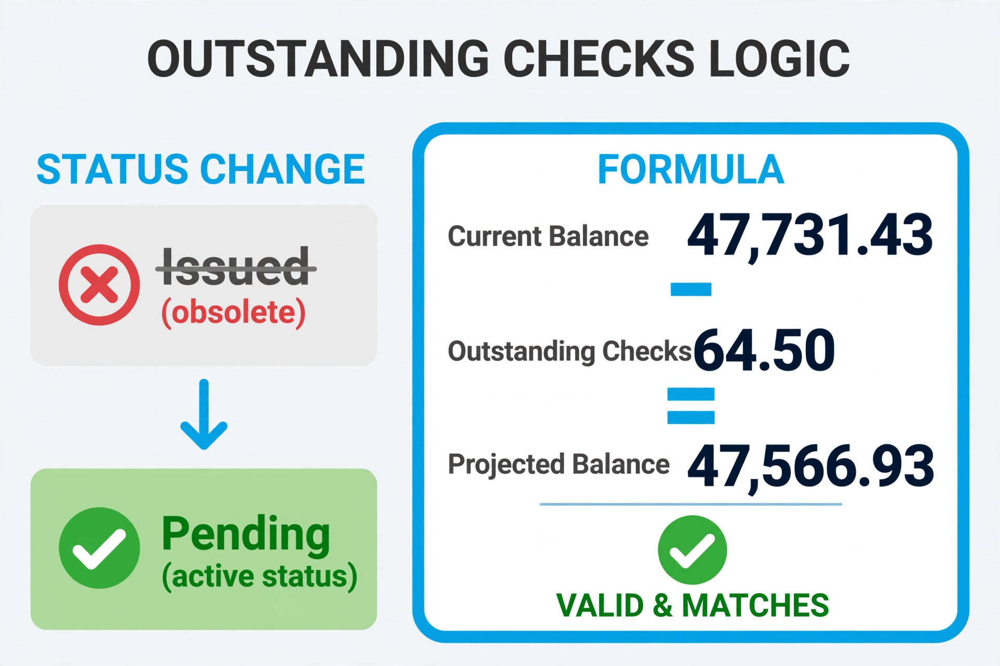
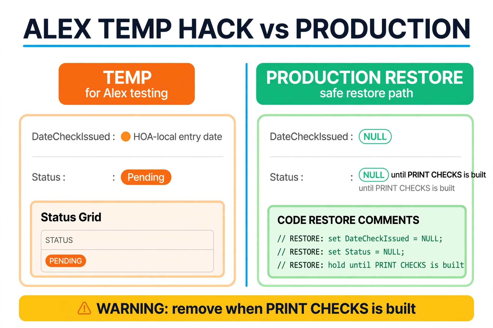

# CR + DP Consolidation — Report for `e7ef7cf`

> Commit: `e7ef7cf — Complete CR bank reconciliation and outstanding checks`
> (Rick, 2026-09-13) · Branch: `BravoFrontend` · Reviewer: Jose · Date: 2026-09-13
> Images: `meta/muse-image` via OpenRouter (~$0.04 total)
> Scope: **diff-review only — no live test** (`server.js` hold-off in force).

## 1. What changed (one commit, 4 fronts, 14 files)

| Front | Change | Verified in diff |
|---|---|---|
| B.2 ZIP swap | `zipcode-detail-lookup` → `zip-to-tz ^1.1.0` | ✅ package.json + `zipToTz(zip) ?? null`; Cash Flow page consolidated to `getHoaTimeZone(db)` (double `lookupZip` gone) |
| DP numbering | MySQL `NOW(2)` → HOA-local | ✅ `` `DP${(await hoaNow(conn)).transactionStamp}` `` |
| DP `TimeStampCreated` | `NOW()` → UTC | ✅ INSERT binds `createdAt = hoaNow.utcDateTime` |
| CR Pending→Cleared | new clear + date adjustment | ✅ `changeIssuedDate`, future rejected, CashFlow date follows w/o duplicate |
| Outstanding | `Issued` → `Pending` | ✅ Outstanding query; `147,731.43 − 164.50 = 147,566.93` ✅ |
| Alex temp hack | printed-simulation w/ restore notes | ✅ `TEMPORARY ALEX TESTING` blocks + exact production lines in `RESTORE` comments |

## 2. Outstanding math

## 3. Alex hack vs production (watch item)

The temporary behavior (new checks enter with HOA-local `DateCheckIssued` +
`Pending`) is fenced by explicit `REMOVE WHEN PRINT CHECKS IS BUILT` blocks
with the exact production lines preserved in comments. Only residual risk:
the temp must not outlive PRINT CHECKS — tracked here, not just in comments.

## 4. Not tested live

No backend restart / API test was run for `e7ef7cf`: the working backend runs
the pre-push tree and `server.js` ownership is Rick's until he signals clear.
UTC clear-path lines are unchanged in the diff (no regression vs `4cd016f`,
verified live earlier).

## 5. Next steps

1. Rick: remaining accounting cleanup, then explicit "`server.js` clear".
2. Then: rebase + push local docs (`e0f7b3e` + this report).
